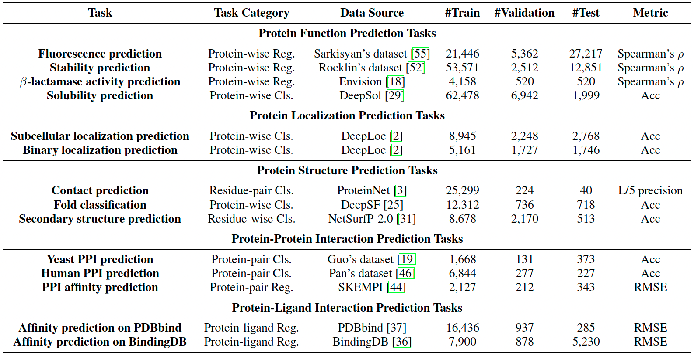

# PEER: A Comprehensive and Multi-Task Benchmark for Protein Sequence Understanding

This is the official codebase of the paper [PEER: A Comprehensive and Multi-Task Benchmark for Protein Sequence Understanding](https://arxiv.org/pdf/2206.02096.pdf).

[Minghao Xu*](https://chrisallenming.github.io),
[Zuobai Zhang*](https://oxer11.github.io),
[Jiarui Lu](https://mila.quebec/en/person/jiarui-lu/),
[Zhaocheng Zhu](https://kiddozhu.github.io),
[Yangtian Zhang](https://zytzrh.github.io/),
[Chang Ma](https://github.com/chang-github-00),
[Runcheng Liu](https://www.runchengliu.com/),
[Jian Tang](https://jian-tang.com)
(*equal contribution)

## Overview ##

PEER is a **comprehensive** and **multi-task** benchmark for protein sequence understanding. 
It contains 14 tasks of protein understanding lying in 5 task categories 
including protein function prediction, protein localization prediction, protein structure prediction, protein-protein interaction prediction and protein-ligand interaction prediction. 
On this benchmark, we evaluate different types of sequence-based methods for each task 
including traditional feature engineering approaches, different sequence encoding methods as well as large-scale pre-trained protein language models 
under both **single-task learning** and **multi-task learning** settings.



This codebase is based on PyTorch and **TorchProtein-dev**, a developing version of [TorchDrug] specific to protein applications.
This benchmark codebase as well as the finished TorchProtein platform *will be released to public soon.*

[TorchDrug]: https://github.com/DeepGraphLearning/torchdrug

## Installation ##

You may install the dependencies of TorchProtein-dev and PEER benchmark as below. 
Generally, they work with Python 3.7/3.8 and PyTorch version >= 1.8.0.

```bash
conda create -n protein python=3.7
conda activate protein

conda install pytorch==1.8.0 cudatoolkit=10.2 -c pytorch
conda install scikit-learn pandas decorator ipython networkx tqdm matplotlib -y
conda install pytorch-scatter pytorch-cluster -c pyg -c conda-forge
pip install fair-esm transformers easydict pyyaml lmdb

cd TorchProtein-dev
python setup.py develop
cd ../
```

## Reproduction ##

### Experimental Configurations ###

We provide a yaml based config for each benchmark experiment in our paper. 
The configs of all baselines for single-task and multi-task learning are stored in ```./config/``` with the following folder structure:

```
config
 └── single_task
     ├── ESM
     │   ├── Task_ESM.yaml
     │   ├── Task_ESM_fix.yaml
     ├── ProtBert
     ├── LSTM
     ├── BERT
     ├── CNN
     ├── ResNet
     ├── DDE
     ├── Moran
 ├── multi_task
     ├── ESM
     │   ├── CenterTask_AuxiliaryTask_ESM.yaml
     ├── BERT
     ├── CNN
```

### Launch Experiments ###

In each config, we give a **suggested GPU configuration**, considering the tradeoff between *dataset size* and *computational resource*.
We assume **Tesla-V100-32GB GPUs** as the computational resource.
You can change this default configuration based on your own computational resource.

*Note.* The benchmark results can be reproduced by taking the mean and std of three runs with ```--seed 0```, ```--seed 1``` and ```--seed 2```. 

**Single-GPU.** By setting ```gpus: [0]```, the experiment is performed under a single GPU.
You can use the following command to run with seed 0, where all datasets will be automatically downloaded in the code.

Single-task learning experiment:
```bash
python script/run_single.py -c config/single_task/$model/$yaml_config --seed 0
```

Multi-task learning experiment:
```bash
python script/run_multi.py -c config/multi_task/$model/$yaml_config --seed 0
```

**Multi-GPU.** By setting ```gpus: [0,1,2,3]```, the experiment is performed under a single machine with 4 GPUs.
You can use the following command to run with seed 0.

Single-task learning experiment:
```bash
python -m torch.distributed.launch --nproc_per_node=4 script/run_single.py -c config/single_task/$model/$yaml_config --seed 0
```

Multi-task learning experiment:
```bash
python -m torch.distributed.launch --nproc_per_node=4 script/run_multi.py -c config/multi_task/$model/$yaml_config --seed 0
```

**Multi-Machine.** By setting ```gpus: [0,1,2,3,0,1,2,3]```, the experiment is performed under 2 machines with 4 GPUs in each machine.
You can use the following command to run with seed 0.

Single-task learning experiment:
```bash
python -m torch.distributed.launch --nnodes=2 --nproc_per_node=4 script/run_single.py -c config/single_task/$model/$yaml_config --seed 0
```

Multi-task learning experiment:
```bash
python -m torch.distributed.launch --nnodes=2 --nproc_per_node=4 script/run_multi.py -c config/multi_task/$model/$yaml_config --seed 0
```

License
-------

This codebase is released under the Apache License 2.0 as in the [LICENSE](LICENSE) file.
